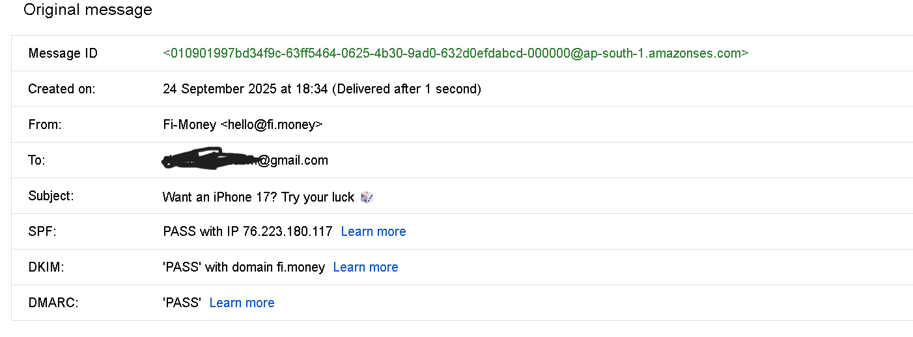
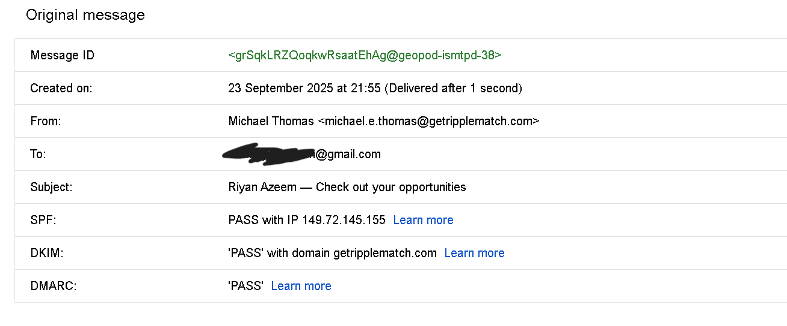

# Header analysis of a phishing email

**1. “Prize / Lottery Phishing Email”, also called a “Free Gift / Scam Offer”.

It tempts the user with a fake reward — in this case, “Want an iPhone 17? Try your luck” — to make them click a malicious link or provide personal information.

**Phishing Traits in This Email**

- Subject line: “Want an iPhone 17? Try your luck ” → classic bait using an attractive offer.

- Sender address: hello@fi.money (may be spoofed or abused). It looks legitimate but could be used for spam.

- Urgency/Excitement: Creates curiosity and greed (“win a free iPhone”).

- Likely hidden link/redirect: Such emails usually contain buttons or links leading to fake sites, credential harvesters, or adware.

- SPF/DKIM/DMARC: They all pass — meaning the domain is valid and not spoofed, but scammers sometimes use compromised or low-reputation domains to bypass filters.

This email is a classic prize/lottery phishing message that tries to lure the recipient with an enticing reward — “Want an iPhone 17? Try your luck  ”. Its goal is social-engineering: provoke curiosity and excitement so the user clicks a link or fills a form that captures credentials, personal data, or payment details. Prize scams commonly lead to credential harvesters, fake surveys that ask for sensitive info, or sites that silently install adware/malware.

Although the header shows SPF, DKIM and DMARC all passing, that does not guarantee the message is safe. Passing authentication means the message legitimately originated from the sending domain or from an authorized mail service for that domain — but attackers sometimes use compromised accounts, malicious marketing services, or lookalike domains to send phishing at scale while passing those checks. Always combine header results with content inspection.

**Primary risks if clicked:**

- Account credential theft (login/password reuse attacks).

- Financial fraud if payment or card details are provided.

- Malware or unwanted software installations.

- Personal data harvesting for future targeted attacks.

**Recommended actions:**

- Do not click any links or open attachments.

- Inspect the message headers and the exact link targets (copy link, check domain).

- If you manage the recipient domain, quarantine and block the sender if malicious.

- Report the email to your email provider and to threat intel services if appropriate (PhishTank/OpenPhish).

- If any credentials were entered, immediately change passwords and enable 2FA on affected accounts.

  **2. Employment Scam Phishing Email**

  

This is an example of a Job Recruitment / Career Opportunity Phishing Email.
It pretends to come from a recruitment platform (RippleMatch) and tries to convince the recipient to click on “View My Opportunities” to apply for jobs. If it’s genuine, it would lead to the official RippleMatch platform. But if malicious, the link could lead to a fake site designed to steal login credentials, CV details, or other personal data.

**Phishing Traits in This Email**

- Personalization: It uses the recipient’s name (“Hi Riyan Azeem”) → attackers often do this to gain trust.

- Sender domain: getripplematch.com passes SPF, DKIM, and DMARC → meaning it likely came from a real or authorized domain. But attackers sometimes exploit compromised accounts or use lookalike domains.

- Content style: Encourages quick action → “apply before they expire,” which pressures the recipient.

- Suspicious link risk: The “View My Opportunities” button could redirect to a phishing login page.

- Excessive branding: Mentions awards, social media links, and a signature block → often used to look more legitimate and lower suspicion.

This email falls under job recruitment phishing, where attackers disguise messages as career opportunities to steal sensitive information like resumes, job application details, or login credentials. The psychological trigger here is career urgency — people don’t want to miss out on job opportunities.
Even though SPF, DKIM, and DMARC passed, that only proves the email was technically sent from an authorized server. It does not guarantee the intent is safe. If the links are malicious, they could collect credentials or download malware.

**Risks if clicked**

- Credential theft if it asks you to log in.

- Personal information leakage (resume, phone, address).

- Targeted scams (attackers could sell or misuse your data).

 **Safe Actions**

- Hover over the “View My Opportunities” link → check the actual destination domain.

- If unsure, go directly to the official RippleMatch website instead of clicking the email.

- Report to email provider if suspicious.

- If clicked and credentials entered, reset your password immediately.
