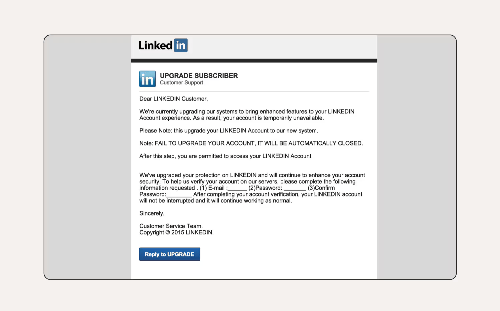

# These are some sample phishing email

**1. Socialmedia phishing email**

Social media phishing emails can be the launchpad for Facebook, LinkedIn, TikTok, X (formerly Twitter), and Instagram scams. They usually mimic the platforms’ branding and logo to trick you into clicking malicious links or divulging sensitive data.

Phishing attacks related to social media scams often:

Urge you to take immediate action to prevent an account from being disabled or deleted.
Ask you to reset a compromised password or confirm login credentials.
Include an alert that someone reported you to the administrator.

In this LinkedIn scam, the user’s name isn’t specified in the greeting, which means it’s likely sent to multiple email addresses in bulk. The business name is in all capital letters throughout the email, which is not their trademark or branding. There are multiple grammar issues, which is uncommon for a reputable organization. LinkedIn will also never ask you for your password via email.

**2. Paypal phishing emails**

Common PayPal scams include phishing emails that claim your account is about to be suspended or deleted, you've received a payment, or you’ve been paid too much. These emails often come with a link, prompting you to enter your password on a fake webpage.

Always log into PayPal directly to verify payments and notifications. Report suspicious emails to phishing@paypal.com and delete them from your inbox.

In this phishing email the user’s name hasn’t been specified and it’s a generic greeting. The first sentence provokes a sense of urgency, hoping the user acts without thinking. There are also grammar and spelling errors in the email if you look closely.

**3. Amazon phishing email**

These days many of us shop on Amazon regularly, with multiple orders out at the same time. Amazon scammers take advantage of this by sending emails that pressure recipients to act quickly and include links to fraudulent websites. Clicking these links can lead to a malware infection or information theft.

*Examples of Amazon phishing emails include:*

- Messages about locked or suspended accounts.
- Shipping emails for items that you didn’t order.
- Prompts to update payment info.
- Fake gift card surveys.

This Amazon phishing email comes from a suspicious email address, doesn’t include the customer’s name, and pressures the customer to update their payment information quickly.
